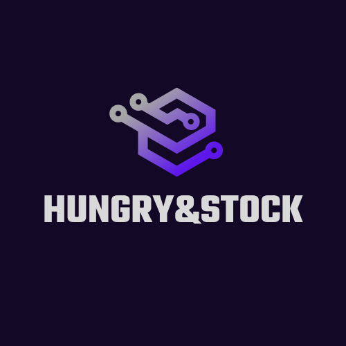

#
# </img> 
# ⮞ HUNGRY & STOCK 
### • Trabalho de engenharia de requisitos desenvolvido para a faculdade de ciências da computação. O objetivo é desenvolver todo um projeto de sotware passando por todas etapas da engenharia de requisitos exigidas pelo mercado.
### • Sobre a HUNGRY & STOCK: É um software desenvolvido com o objetivo principal de controle de estoque de uma forma automática.
#
# ⮞ Integrantes:
- Pedro Lara
- Rafael Mundim
- João Eduardo
- Alexandre Gonçalves
- Giovane
#
## ⮞ ENGENHARIA DE REQUISITOS COMPLETA: [POWER POINT](https://docs.google.com/presentation/d/12OZ5GDF0Zms1LI3mZ76XQiadnegbBADp/edit?usp=sharing&ouid=110729681681874716441&rtpof=true&sd=true)
